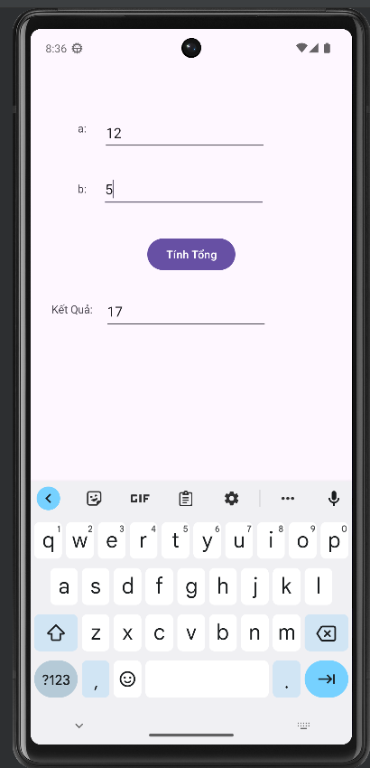

# 63130274-AndroidProgramming
Lưu các bài tập thực hành, bài tập dự án trong học tập trên Android Studio.

Các bài thực hành và bài tập được lưu tại đây và Push lên server thường xuyên để thầy tracking quá trình.

Bài tập:

Ex1_ConstrainLayout:

Ex2_LinearLayout:

Ex3_SimpleSumApp (AppCong):

Ex4_AddSubMulDiv_Onclick:

Ex5_AddSubMulDiv_Anynomous:

Ex6_IntentDonGian:

Màn Hình 2:

Màn Hình 3:

Ex7_IntentLogin
Giao diện đăng nhập:

Sau khi click vào nút:

Sau khi đăng nhập:

Login Screen:

